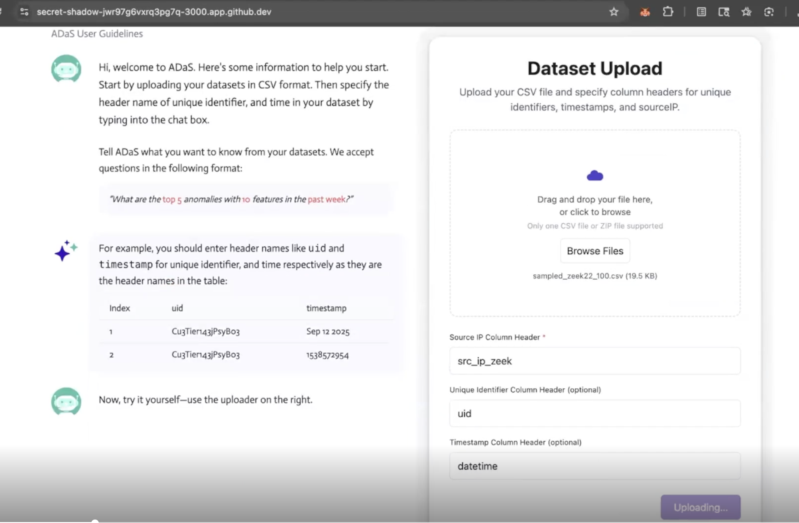
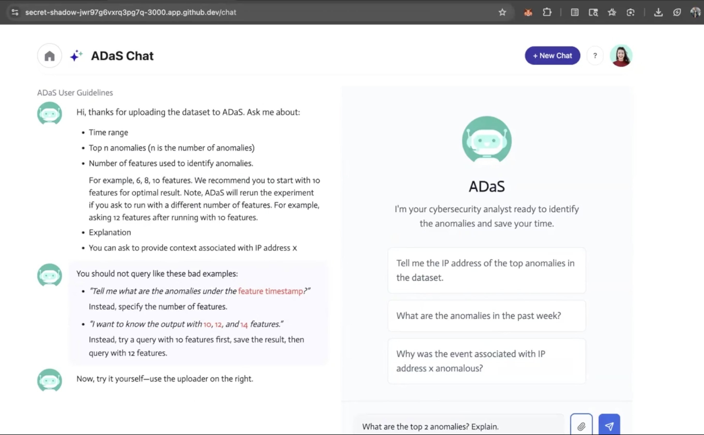
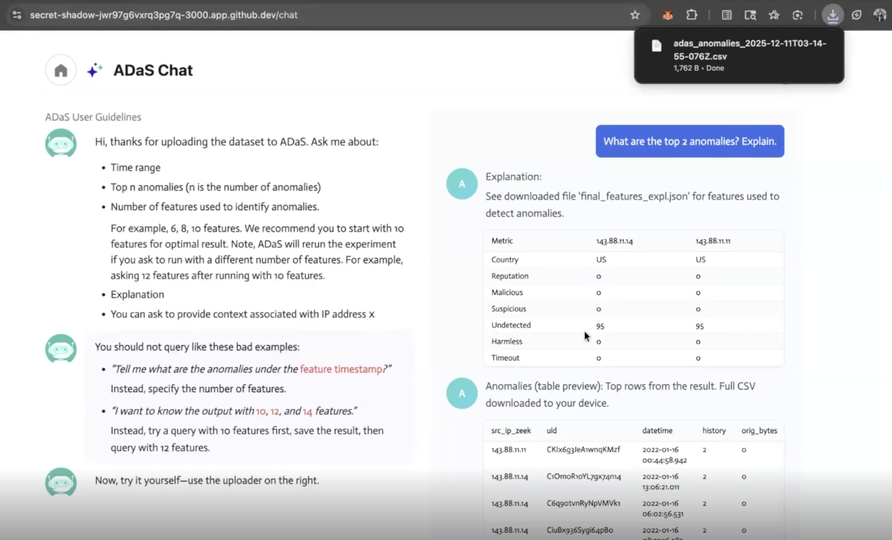
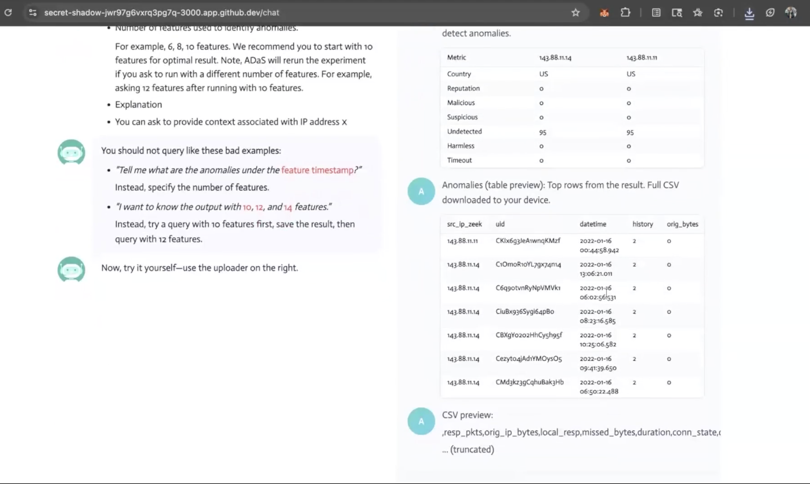
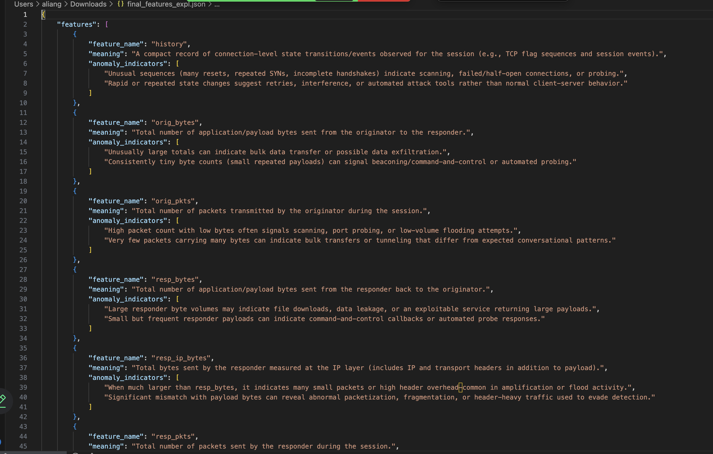
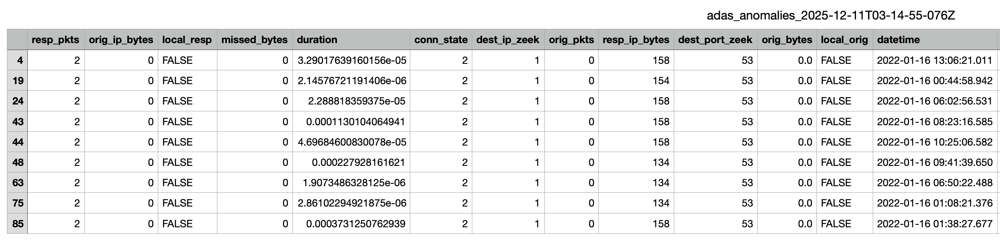
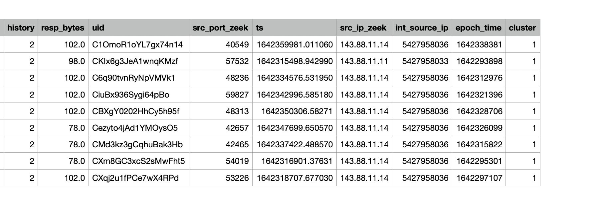

# Autonomous Data Scientist (ADaS): GPU-Accelerated, LLM-Enabled Interface for Anomaly Detection at Scale ​
This project (ADaS 2.0) is an LLM-guided analytic system that interprets user queries, performs accelerated data processing to detect network anomalies, and delivers context-aware, actionable results for SOC analysts. ​It is an extension to our previous project (ADaS 1.0) that aims to integrate unsupervised clustering algorithms, automated feature selection, and reinforcement learning into an autonomous agent with the ability to detect anomalous behavior in network traffic. 

For a detailed abstract, team member roles, and a link to our document repository, please refer to the [ADaS 2.0 Project Wiki](https://github.com/simonegreen/adas_capstone_2025/wiki)

For our previous project, please refer to the [ADaS 1.0 Project Wiki](https://github.com/simonegreen/autonomous_datascientist/wiki)

## ADaS Capstone Demo Guide

This guide walks through how to run an end-to-end demo of the ADaS capstone system, including starting the backend and frontend, configuring environment variables, and performing a live anomaly-detection query on a CSV dataset.

---

## Prerequisites

- Python 3.10 or later  
- Node.js 18 or later  
- npm  
- OpenAI API key  

---

## Backend Setup

### Create backend environment file

Create a file at `backend/.env` with the following contents:

OPENAI_API_KEY=[key redacted]
OPENAI_MODEL=gpt-5-mini

---

### Install backend dependencies

From the project root:

pip install -r backend/requirements.txt

---

### Start the backend server

Run the following command:

uvicorn backend.main:app --reload --port 8000 --host 0.0.0.0

The backend will start on port **8000**.

---

### Expose backend port (Codespaces)

If running in GitHub Codespaces:

1. Open the **Ports** tab
2. Locate port **8000**
3. Set visibility to **Public**

---

## Frontend Setup

### Create frontend environment file

Create a file at `frontend/.env.local` with the following contents:

NEXT_PUBLIC_API_BASE_URL="https://secret-shadow-jwr97g6vxrq3pg7q-8000.app.github.dev"

Replace the URL with your own public Codespaces backend URL if different.

---

### Install frontend dependencies and start dev server

Run
`cd frontend`
`npm i`
`npm run dev`

Open the frontend URL shown in the terminal.

---

## Demo Walkthrough

### Step 1: Upload dataset

In the frontend UI, upload a CSV dataset.

Example dataset used in the demo:

*/workspaces/adas_capstone_2025/data/capstone-data/sampled_zeek22_100.csv*

<!-- Screenshot: Dataset upload UI -->

---

### Step 2: Map required headers

When prompted, enter the following field mappings:

- **source_ip**: `src_ip_zeek`
- **uid (optional)**: `uid`
- **time (optional)**: `datetime`

---

### Step 3: Enter a query prompt

Example prompt used in the demo:

What are the top 2 anomalies? Explain.

---

### Step 4: View results

The frontend will display the anomaly results and explanation returned by the backend.

Downloaded results saved in CSV:

---

## Common Issues

- **Frontend cannot reach backend**
  - Ensure port 8000 is public
  - Verify `NEXT_PUBLIC_API_BASE_URL` points to the backend public URL

- **OpenAI API errors**
  - Confirm `backend/.env` exists
  - Verify `OPENAI_API_KEY` is set correctly

- **Port mismatch**
  - Ensure backend port, Codespaces port, and frontend base URL all match

